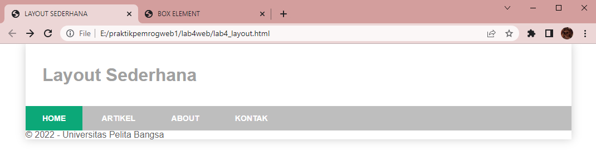
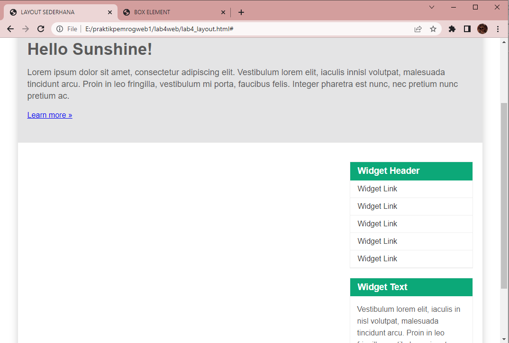

# Web4Lab4

**Nama    : Aning Kinanti** <br>
**NIM     : 312010364** <br>
**Kelas   : TI.20.A2** <br>
**Matkul  : Pemrograman Web** <br>

# Membuat Box Element dan Layout Sederhana

## A. Membuat Box Element
### 1. Membuat File HTML
Buatlah dokumen HTML seperti contoh dibawah ini : <br>
```
    <!DOCTYPE html>
    <html lang="en">
    <head>
        <meta charset="UTF-8">
        <meta http-equiv="X-UA-Compatible" content="IE=edge">
        <meta name="viewport" content="width=device-width, initial-scale=1.0">
        <title>BOX ELEMENT</title>
    </head>
    <body>
        <header>
            <h1>Box Element</h1>
        </header>
    </body>
    </html>
```
<br>

### 2. Membuat Box Element
Lalu tambahkan sintaks dibawah ini pada tag <body> untuk membuat box element dengan tag `<div>` : <br>
```
    <section>
        <div class="div1">DIV 1</div>
        <div class="div2">DIV 2</div>
        <div class="div3">DIV 3</div>
    </section>
```
<br>

### 3. Menambahkan CSS Float Property
Selanjutnya tambahkan deklarasi CSS pada head untuk membuat float element, seperti berikut : <br>
```
    <style>
        div {
            float: left;
            padding: 10px;
        }
        .div1 {
            background: lightcoral;
        }
        .div2 {
            background: burlywood;
        }
        .div3 {
            background: lightgreen;
        }
    </style>
```
<br>

Ini adalah hasil dari sintaks diatas :
 <br>

### 4. Mengatur Clearfix Element
Clearfix digunakan untuk mengatur element setelah float element. Property clear digunakan untuk 
mengaturnya. <br>
Tambahkan element div lainnya seteleah div3 seperti berikut : <br>
```
    <section>
        <div class="div1">DIV 1</div>
        <div class="div2">DIV 2</div>
        <div class="div3">DIV 3</div>
        <div class="div4">DIV 4</div>
    </section>
```
<br>

Kemudian atur property clear pada CSS seperti berikut : <br>
```
    .div4 {
        background-color: lightblue;
        clear: left;
        float: none;        
    }
```
<br>

Ini adalah hasil dari sintaks diatas :
 <br>

## B. Membuat Layout Sederhana
### 1. Membuat File HTML
Buatlah dokumen HTML seperti contoh dibawah ini : <br>
```
    <!DOCTYPE html>
    <html lang="en">
    <head>
        <meta charset="UTF-8">
        <meta http-equiv="X-UA-Compatible" content="IE=edge">
        <meta name="viewport" content="width=device-width, initial-scale=1.0">
        <title>LAYOUT SEDERHANA</title>
        <link rel="stylesheet" href="style_layout.css">
    </head>
    <body>
        <div id="container">
            <header>
                <h1>Layout Sederhana</h1>
            </header>
        </div>
    </body>
    </html>
```
<br>

Kemudian tambahkan sintaks kode seperti dibawah ini : <br>
```
    <nav>
        <a href="home.html" class="active">HOME</a>
        <a href="artikel.html">ARTIKEL</a>
        <a href="about.html">ABOUT</a>            
        <a href="kontak.html">KONTAK</a>
    </nav>
    <section id="hero"></section>
    <section id="wrapper">
        <section id="main"></section>
        <aside id="sidebar"></aside>
    </section>
    <footer>
        <p>&copy; 20212 - Universitas Pelita Bangsa</p>
    </footer>

```
<br>

Ini adalah hasil dari sintaks diatas :
 <br>

### 2. Menambahkan file CSS 
Buatlah dokumen file CSS dengan nama style_layout.css dengan sintaks seperti contoh dibawah ini : <br>
```
    /* RESET CSS*/
    * {
        margin: 0;
        padding: 0;
    }

    body {
        line-height: 1;
        font-size: 100%;
        font-family: 'Open Sans', sans-serif;
        color: #5a5a5a;
    }

    #container {
        width: 980px;
        margin: 0 auto;
        box-shadow: 0 0 1em #ccc;
    }

    /* HEADER*/
    header {
        padding: 20px;
    }

    header h1 {
        margin: 20px 10px;
        color: #a0a0a0;
    } 
```
<br>

### 3. Membuat Navigasi
Mengatur navigasi pada file CSS dengan sintaks seperti contoh dibawah ini : <br>
```
    /* NAV */
    nav {
        display: block;
        background-color: #bebebe;
    }

    nav a {
        padding: 15px 30px;
        display: inline-block;
        color: #fff;
        font-size: 14px;
        text-decoration: none;
        font-weight: bold;
    }

    nav a.active,
    nav a:hover {
        background-color: #0ca878;
    }
```
<br>

Ini adalah hasil refresh dari sintaks diatas :
 <br>

### 4. Membuat Hero Panel
Buat hero panel dengan menambahkan sintaks HTML seperti dibawah ini : <br>
```
   <section id="hero">
        <h1>Hello Sunshine!</h1>
        <p>Lorem ipsum dolor sit amet, consectetur adipiscing elit. Vestibulum lorem 
            elit, iaculis innisl volutpat, malesuada tincidunt arcu. Proin in leo fringilla, 
            vestibulum mi porta, faucibus felis. Integer pharetra est nunc, nec pretium nunc 
            pretium ac.</p>
        <a href="home.html" class="btn btn-large"> Learn more &raquo;</a>
    </section>
```
<br>

Kemudian tambahkan file CSS seperti dibawah ini : <br>
```
   /* HERO PANEL */
#hero {
    background-color: #e4e4e5;
    padding: 50px 20px;
    margin-bottom: 20px;
}

#hero h1 {
    margin-bottom: 20px;
    font-size: 35px;
}

#hero p {
    margin-bottom: 20px;
    font-size: 18px;
    line-height: 25px;
}
```
<br>

Ini adalah hasil refresh dari sintaks diatas :
 <br>

### 5. Mengatur Layout dan Sidebar
Untuk mengatur main content dan sidebar, tambahkan sintaks css seperti dibawah ini : <br>
```
    /* MAIN CONTENT */
    #wrapper {
        margin: 0;
    }
    #main {
        float: left;
        width: 640px;
        padding: 20px;
    }

    /* SIDEBAR AREA */
    #sidebar {
        float: left;
        width: 260px;
        padding: 20px;
    }
```
<br>

### 6. Membuat Sidebar Widget
Tambahkan element lain pada sidebar dengan sintaks css seperti dibawah ini : <br>
```
    <aside id="sidebar">
        <div class="widget-box">
            <h3 class="title">Widget Header</h3>
            <ul>
                <li><a href="#">Widget Link</a></li>
                <li><a href="#">Widget Link</a></li>
                <li><a href="#">Widget Link</a></li>
                <li><a href="#">Widget Link</a></li>
                <li><a href="#">Widget Link</a></li>
            </ul>
        </div>
        <div class="widget-box">
            <h3 class="title">Widget Text</h3>
            <p>Vestibulum lorem elit, iaculis in nisl volutpat, malesuada tincidunt 
            arcu. Proin in leo fringilla, vestibulum mi porta, faucibus felis. Integer 
            pharetra est nunc, nec pretium nunc pretium ac.</p>
        </div>
    </aside>
```
<br>

Kemudian tambahkan sintaks CSS seperti dibawah ini : <br>
```
    /* WIDGET */
    .widget-box {
        border: 1px solid #eee;
        margin-bottom: 20px;
    }

    .widget-box .title {
        padding: 10px 16px;
        background-color: #0ca878;
        color: #fff;
    }

    .widget-box ul {
        list-style-type: none;
    }

    .widget-box li {
        border-bottom: 1px solid #eee;
    }

    .widget-box li a {
        padding: 10px 16px;
        color: #333;
        display: block;
        text-decoration: none;
    }

    .widget-box list-style:hover a {
        background-color: #eee;
    }

    .widget-box p {
        padding: 15px;
        line-height: 25px;
    }
```
<br>

Ini adalah hasil refresh dari sintaks diatas :
 <br>

### 7. Mengatur Footer
Mengatur footer dengan sintaks css seperti dibawah ini : <br>
```
    /* FOOTER */
    footer {
        clear: both;
        background-color: #1d1d1d;
        padding: 20px;
        color: #eee;
    }  
```
<br>

Ini adalah hasil refresh dari sintaks diatas :
 <br>

### 8. Menambahkan Elemen Lainnya pada Main Content
Menambahkan elemen lain dengan sintaks css seperti dibawah ini : <br>
```
<section id="main">
    <div class="row">
        <div class="box">
            
            <h3>Heading</h3>
            <p>Donec sed odio dui. Etiam porta sem malesuada magna mollis 
                euismod.</p>
            <a href="#" class="btn btn-default">View Detail</a>
        </div>
        <div class="box">
            
            <h3>Heading</h3>
            <p>Donec sed odio dui. Etiam porta sem malesuada magna mollis 
                euismod.</p>
            <a href="#" class="btn btn-default">View Detail</a>
        </div>
        <div class="box">
            
            <h3>Heading</h3>
            <p>Donec sed odio dui. Etiam porta sem malesuada magna mollis 
                euismod.</p>
            <a href="#" class="btn btn-default">View Detail</a>
        </div> 
    </div>
</section>
```
<br>

Kemudian tambahkan sintaks pada CSS seperti dibawah ini : <br>
```
    /* BOX */
    .box {
        display: block;
        float: left;
        width: 33.333333%;
        box-sizing: border-box;
        -moz-box-sizing: border-box;
        -webkit-box-sizing: border-box;
        padding: 0px 10px;
        text-align: center;
    }

    .box h3 {
        margin: 15px 0px;
    }

    .box p {
        line-height: 20px;
        font-size: 14px;
        margin-bottom: 15px;
    }

    .box img {
        border: 0;
        vertical-align: middle;
    }

    .image-circle {
        border-radius: 50%;
    }

    .row {
        margin: 0 -10px;
        box-sizing: border-box;
        -moz-box-sizing: border-box;
        -webkit-box-sizing: border-box;
    }

    .row:after, .row:before,
    .entry:after, .entry:before {
    content:'';
    display:table;
    }
    .row:after,
    .entry:after {
    clear:both;
    }
```
<br>

Ini adalah hasil refresh dari sintaks diatas :
 <br>


